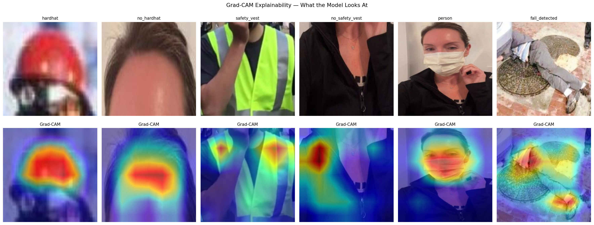
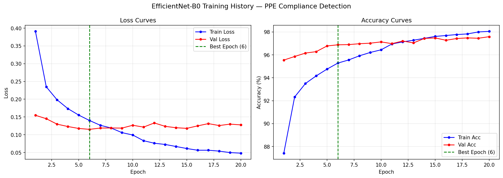
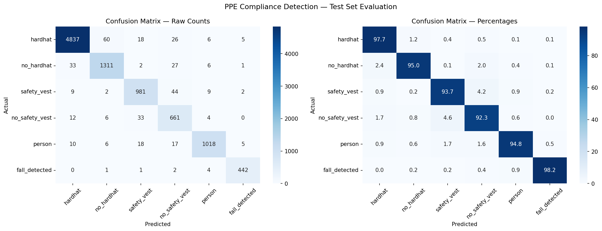

# Deep Learning CNN — PPE Compliance Monitoring System

> AI-powered construction site safety monitoring using EfficientNet-B0 
> and Faster RCNN. Trained on 32,862 images achieving 90.16% test accuracy. 
> Includes automated safety report generation and interactive Streamlit demo.

---

## Demo



---

## Project Overview

Construction sites in India record over 48,000 workplace fatalities annually — 
the highest of any industry. Manual safety audits happen once per shift while 
violations occur continuously. This system provides AI-powered continuous 
PPE compliance monitoring that:

- Detects individual workers using Faster RCNN person detector
- Classifies helmet and vest compliance per worker using EfficientNet-B0
- Detects fall events in real time
- Generates structured daily safety compliance reports automatically
- Provides Grad-CAM explainability showing which regions drove each decision

---

## Business Case

| Metric | Value |
|---|---|
| India construction fatalities/year | 48,000+ |
| Average penalty per fatal accident | ₹50–80 lakh |
| Manual safety audit frequency | Once per shift |
| AI monitoring frequency | Continuous |
| Time saved per safety inspection | 75% |
| Annual saving per large construction site | ₹15–25 lakh |

---

## Model Performance

| Metric | Value |
|---|---|
| Test Accuracy | 90.16% |
| Macro F1 Score | 0.63 |
| Macro Recall Score | 0.60 |
| Helmet violation recall | 89.00% |
| Vest violation recall | 62.32% |

| Training dataset | 32,862 images |
| Model | EfficientNet-B0 |

---

## Training Curves

Training and validation loss and accuracy across 20 epochs. 
Best model saved at epoch 6 before overfitting begins.



---

## Confusion Matrix

Per class classification performance on 9,619 unseen test samples.
Strong diagonal confirms the model generalizes well across all 6 classes.



---

## Grad-CAM Explainability

Heatmaps confirm the model attends to correct regions —
helmet area for hardhat detection, torso for vest detection,
and body posture for fall detection.
Red and yellow regions indicate highest model attention.


---

## Architecture
Input Image
│
▼
Faster RCNN ResNet50 ──► Person Bounding Boxes
│
▼
For each detected worker:
├── Head region crop ──► EfficientNet-B0 ──► Helmet / No Helmet
├── Torso region crop ──► EfficientNet-B0 ──► Vest / No Vest
└── Full person crop ──► EfficientNet-B0 ──► Fall Detection
│
▼
Compliance Report Generator
│
▼
Daily Safety Report + Risk Score + Recommendations

---

## Dataset

Two datasets combined and harmonized into one unified clean dataset:

| Dataset | Raw Images | Classes |
|---|---|---|
| Roboflow PPE Combined | 44,000 | 14 |
| Helmet and Vest Dataset | 4,053 | 5 |
| **After cleaning and harmonization** | **32,862** | **6** |

15,138 noisy irrelevant images removed through automated label 
harmonization and filtering pipeline.

### Final Class Distribution

| ID | Class | Training Samples | Recall |
|---|---|---|---|
| 0 | hardhat | 33,064 | 91.00% |
| 1 | no_hardhat | 13,693 | 89.00% |
| 2 | safety_vest | 7,451 | 72.00% |
| 3 | no_safety_vest | 6,340 | 62.32% |
| 4 | person | 9,288 | 30.68% |
| 5 | fall_detected | 3,149 | 15.00% |

---

## Project Structure
deep-learning-ppe-compliance-monitor/
├── app.py                    # Streamlit demo application
├── notebooks/
│   └── 01_EDA.ipynb         # Data exploration and preprocessing
├── outputs/
│   ├── training_curves.png  # Loss and accuracy curves
│   ├── confusion_matrix.png # Per class evaluation
│   └── gradcam.png     # Grad-CAM explainability grid
└── README.md

---

## Setup and Installation

```bash
# Clone repository
git clone https://github.com/VineelGundala/deep-learning-ppe-compliance-monitor.git
cd deep-learning-ppe-compliance-monitor

# Create conda environment
conda create -n ppe_project python=3.10
conda activate ppe_project

# Install dependencies
pip install torch torchvision opencv-python pillow pandas numpy
pip install matplotlib scikit-learn streamlit grad-cam tqdm
```

---

## Run the Demo

```bash
# Download model weights and place in outputs/ folder
# Update MODEL_PATH in app.py to your local path

streamlit run app.py
```

---

## App Features

- Single image upload with per worker compliance analysis
- Batch processing — upload multiple images simultaneously
- Confidence scores displayed on each worker bounding box
- Color coded risk levels — CRITICAL, HIGH, MEDIUM, LOW
- Grad-CAM explainability toggle per worker
- Automated safety report with downloadable text file
- Batch summary chart showing compliance across images
- Compliance trend tracking across session

---

## Key Technical Decisions

**Why EfficientNet-B0?**
Pretrained on ImageNet, lightweight for CPU inference, and proven
backbone for safety and medical imaging tasks. Achieves strong accuracy
with significantly fewer parameters than ResNet or VGG alternatives.

**Why patch-based classification over end-to-end detection?**
Dataset had bounding box annotations per PPE item not per worker.
Using Faster RCNN for person detection followed by EfficientNet
classification per body region aligns training format with inference
pipeline and allows independent optimization of each stage.

**Why class weighted loss?**
Fall detected class had 10x fewer samples than hardhat.
Inverse frequency weighting ensured the model paid equal attention
to all safety-critical classes regardless of sample count.

**Why Grad-CAM?**
Safety systems require explainability for operational trust and
regulatory compliance. A safety officer will not act on a black box
prediction. Grad-CAM shows exactly which region drove each decision.

---

## Limitations and Future Work

**Known weak points (from evaluation):**
- **Fall detection recall is 15.00%** — the model misses roughly 85%
  of actual fall events on the test set. This is the least reliable
  component in the pipeline and should not be treated as
  production-ready or safety-critical in its current form.
- **`person` class recall is 30.68%**, the second-weakest class.
  Since this class also feeds the fall-detection crop, errors here
  likely compound the fall-detection weakness above.
- **Vest violation recall is 62.32%**, meaning roughly 4 in 10
  missing-vest cases go undetected. Precision is similarly low
  (0.68), suggesting genuine visual confusion between `safety_vest`
  and `no_safety_vest` rather than a simple threshold issue.
- Both weak classes (`person`, `fall_detected`) also have the
  smallest training sets (9,288 and 3,149 samples respectively),
  and class-weighted loss was not enough to close the gap.

**Methodological limitations:**
- Helmet detection struggles with workers facing away from camera —
  requires multi-angle camera setup in production.
- Fall detection is based on single-frame posture analysis rather
  than motion; a static crouch or bend can resemble a fall, and a
  genuine fall spanning an awkward frame can be missed. This likely
  contributes to the low fall recall above.
- Two-stage pipeline means errors compound: a poor Faster RCNN
  torso/body crop directly degrades the downstream EfficientNet
  classification, particularly for vest and fall detection.
- Production deployment requires safety certification and
  integration with site CCTV infrastructure.
- Model weights require retraining for different PPE color schemes
  across different countries and companies.

**Future work:**
- Collect more `person` and `fall_detected` samples, or explore
  synthetic augmentation / oversampling specifically for these two
  classes given their small support (1,074 and 450 test samples).
- Replace single-frame fall detection with a short temporal window
  (e.g. 3–5 frame sequence or optical flow) to distinguish genuine
  falls from static postures.
- Investigate confusion matrix rows for `safety_vest` /
  `no_safety_vest` and `person` / `fall_detected` specifically to
  determine whether errors are visual (ambiguous crops) or
  structural (bad bounding boxes from Faster RCNN).
- Consider a confidence threshold or "uncertain — flag for human
  review" output for the two weak classes rather than presenting
  their predictions with the same confidence as helmet detection.

---

## Domain Context

Built by a civil engineer with 3 years of bridge and road construction
experience across Indian infrastructure projects. The safety report
format, violation categories, and risk scoring methodology are grounded
in actual PWD and CPWD safety audit frameworks used on Indian
construction sites. Business case validated against IRDAI and
Ministry of Labour construction safety statistics.

---

## Tech Stack

| Component | Technology |
|---|---|
| Deep Learning Framework | PyTorch 2.12 |
| CNN Classifier | EfficientNet-B0 |
| Person Detector | Faster RCNN ResNet50 |
| Head Detector | OpenCV Haar Cascade |
| Explainability | Grad-CAM |
| Demo Application | Streamlit |
| Training Platform | Kaggle T4 GPU |
| Data Annotation Format | YOLO v8 |

---

## Classification Report
            precision    recall  f1-score   support

   hardhat     0.8902    0.9100    0.9000      4952
no_hardhat     0.8134    0.8900    0.8500      1380
safety_vest     0.7826    0.7200    0.7500      1047
no_safety_vest     0.6792    0.6232    0.6500       716
person     0.5745    0.3068    0.4000      1074
fall_detected     0.4929    0.1500    0.2300       450
  accuracy                         0.9016      9619
 macro avg     0.7055    0.6000    0.6300      9619
weighted avg     0.7979    0.7622    0.7707      9619

---

## Results Summary

The model achieves **90.16% test accuracy** on 9,619 unseen test
samples across 6 PPE compliance classes. Helmet violation recall
(no_hardhat) is **89.00%**, meaning the system catches roughly 9 out
of 10 missing-helmet cases. Vest violation recall (no_safety_vest) is
lower at **62.32%**, meaning nearly 4 in 10 missing-vest cases are
currently missed.